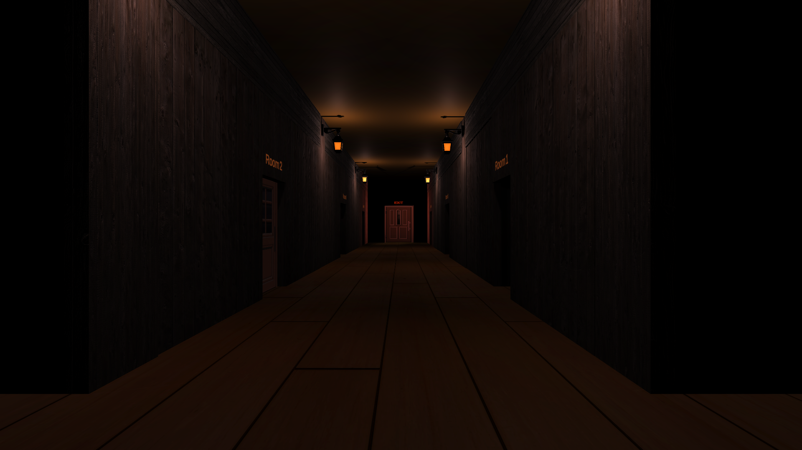

# Serious Game - EscapeRoom++ 



## Overview

Welcome to EscapeRoom++, a 3D Untity Game developed to test your C++ programming skills. Dive in the dungeon and solve the Quizes. Retrieve all the digits to form the escape code and run to the exit!

## Table of Contents

- [Installation](#installation)
- [How to Play](#how-to-play)
- [Directory Structure](#directory-structure)
- [Screenshots](#screenshots)
- [Contributing](#contributing)
- [License](#license)

## Installation

To get started with EscapeRoom++, follow these steps (for <b>Windows</b>):

   1. Clone the Repository

   ```bash
   git clone https://github.com/HliasUniwa/UnityGame
   ```

 2. Run the Game

   From the [Build_EscapeRoom++](/Build_EscapeRoom++) directory you can execute the [TeachGame.exe](/Build_EscapeRoom++/TeachGame.exe) file.


## How to Play

1. Objective:

   Your goal is to retrieve all six digits of the escape pass code in order to escape the C++ dungeon.

   To do so, you have to enter all six rooms. Interact with the npcs and answer the quizes correctly.

2. Controls:

   Use the arrow keys to move your character.

   Use 'E' to interact with the npcs and the exit door.

   Use 'Esc' to pause the game, exit from a quiz and exit from the keypad (that pops up when you interact with the exit door).

4. Difficulties

   The quizes are getting harder from room 1 to room 6, so be prepared to take on a challenge.

## Directory Structure

The repository is organized as follows:

- [Build_EscapeRoom++](/Build_EscapeRoom++): Contains the pre-built game executable and required files.

- [UnityProject_EscapeRoom++](/UnityGame_EscapeRoom++): Contains the source code, assets and other necessary files for Unity.

- [Screenshots](/Screenshots): Contains in-game screenshots.

## Screenshots

Gameplay Screenshot 1
_ _ _


Gameplay Screenshot 2
_ _ _


Gameplay Screenshot 3
_ _ _


## Contributing

Contributions are welcome! If you want to contribute to this project, please follow the guidelines outlined in [CONTRIBUTING.md](https://github.com/HliasUniwa/UnityGame/CONTRIBUTING.md).

* * *

Enjoy the EscapeRoom++ quiz adventure, and may your scores be legendary!
